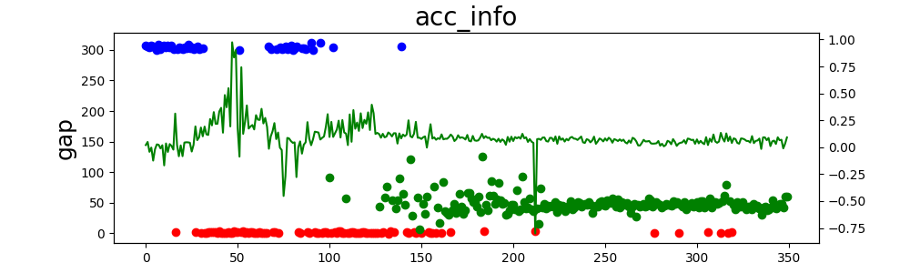
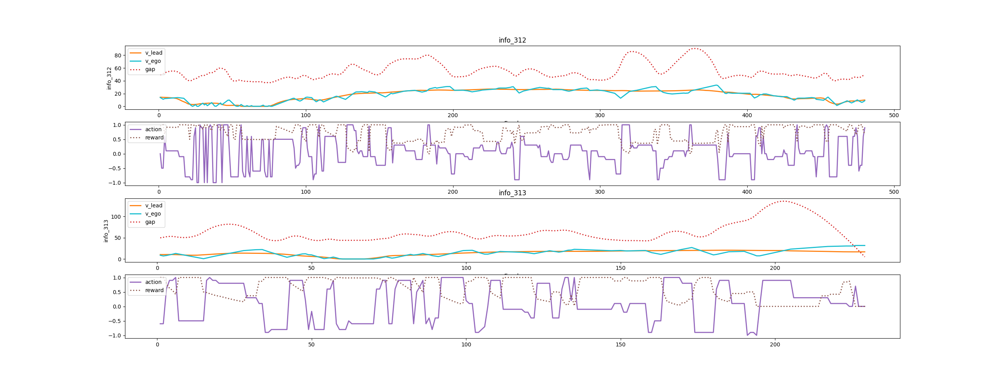
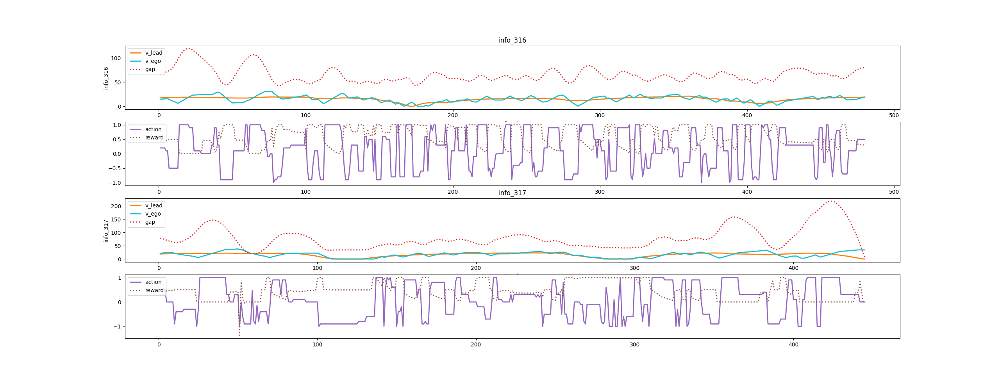
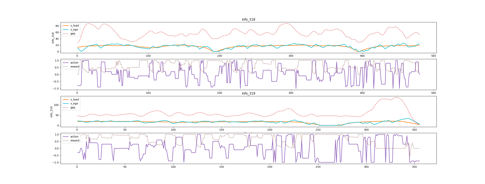

# 2021/08/30 增加YOLOv5识别支持

##### 目前存在的问题：

训练200次迭代之后依然会发生crash：

具体看了一下导致crash的问题，分别抽取了300次之后crash的数据：

第313crash：

第317crash：

第319crash：

可以发现在最后的网络给出的动作中，会出现在gap增大的情况下，网络给出多个减速动作，初步判断可能是yolo识别的问题，由于yolo对原图打锚框，再将原图resize成（80， 80）大小的图像，锚框边框粗细会影响resize之后的图像大小，由于本身车辆大小就比较小，resize之后锚框会导致有效像素点数量增大，导致网络误判。

##### 解决方案：

1. 减小锚框边框宽度
2. 将背景图直接替换为纯黑色，使用opencv将锚框标记在纯黑背景上（提高训练收敛速度）

##### 当前代码对应git版本：commit f467b104e2eb79901cf6e8bed7c258ff60e7c952

##### ***！！！在此代码基础上砍掉了多线程支持！！！***
