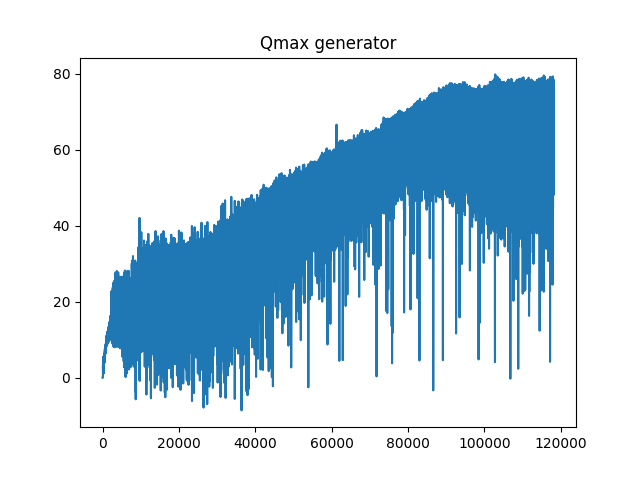
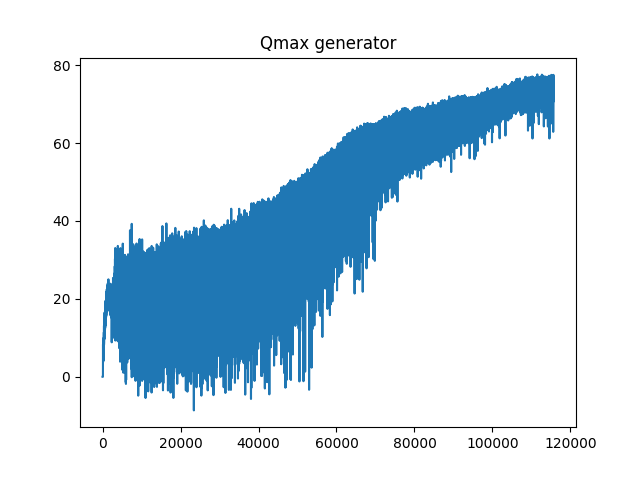
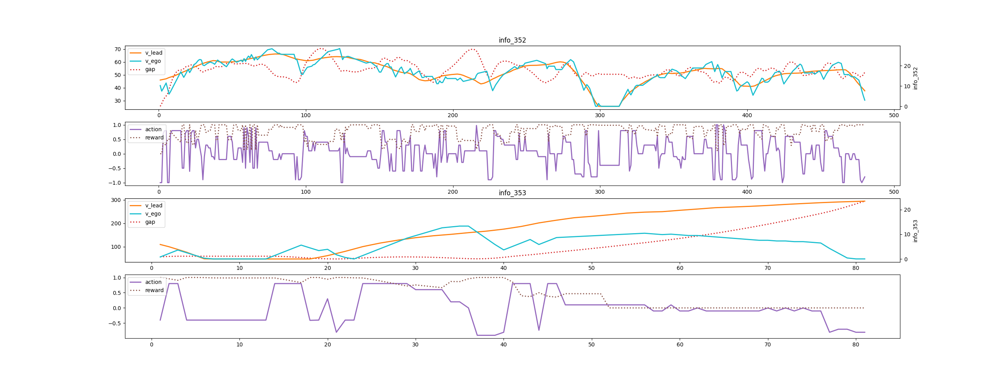
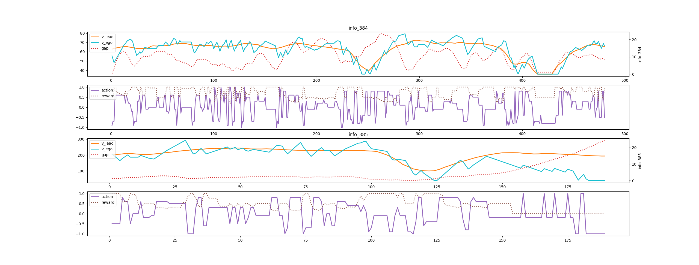
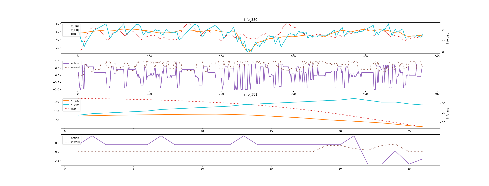
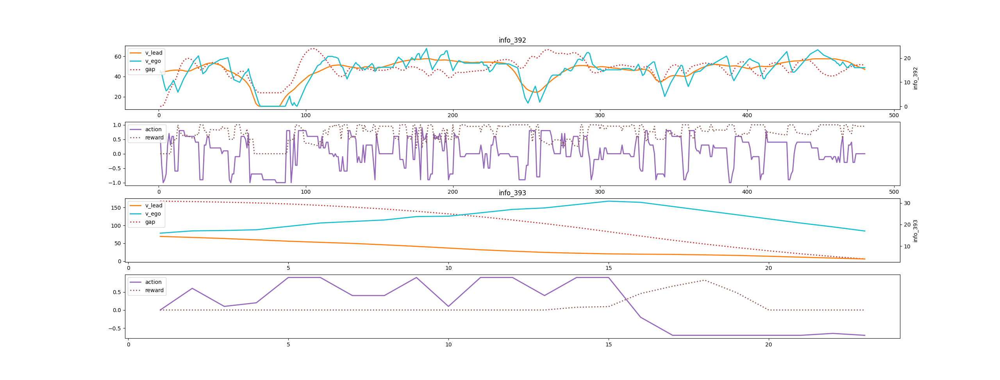

# 2021/9/1-9/2 随机初始距离环境训练和opencv二近邻插值问题

***代码使用train_acc.py训练***

***版本特征：单线程，取消yolo目标检测，resize方式为pillow双插值***

##### 目前存在问题：

200次迭代之后训练出现碰撞和跟丢，具体迭代结果如下：

给出训练单步Qmax步进数据：

给出正常训练Qmax数据：

353loss：

383loss:

383crash:

393crash:

##### 分析：

环境给定迭代200次之后使用随机距离，Qmax的数值在之后的训练中趋于平稳。

可以发现crash情况普遍出现在初始距离过大导致后车加速至前车车速两倍后，两车距离快速缩短，后车网络识别到前车时给出动作为加速度为-1的全减速，但后车车速过快两车距离过近导致撞车。

loss出现在后车失去前车目标情况下，在失去前车目标后可以发现网络输出动作为减速，即放弃无效reward获取。（reward函数问题导致网络训练输出错误动作）

##### 解决方法:

1. 给定后车速度上限
2. 更改reward函数

##### 当前代码对应git版本：commit 6a1775a7016f1dc3e9c6a25b900f50d8453800c7 

##### 训练结果对应时间戳：train_log_1630487505.txt

