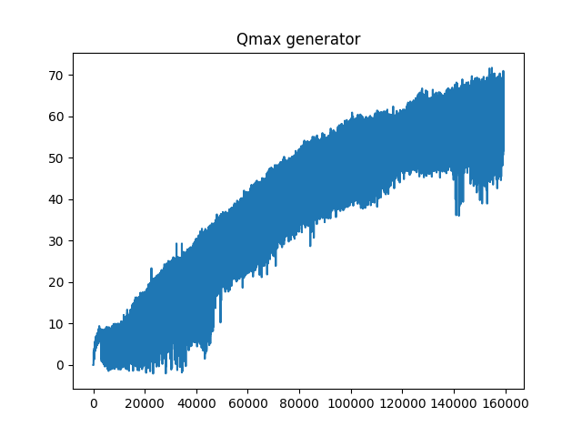
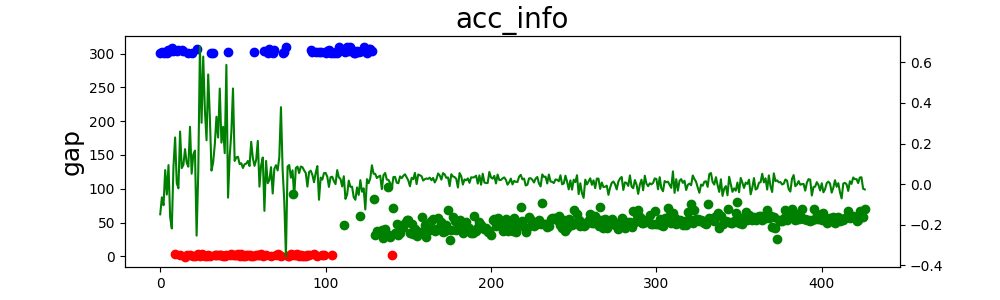

# -20210912_Reward函数设计以及从opencv转到pillow图像处理

##### *训练代码：20210906_Reward_sample.py*

##### *版本特征：增加yolo目标检测，ImageDraw处理检测框，变更reward函数*

##### T=3.5；D=50

##### **Reward函数设计介绍：**

给定两车理想车距(D *)，两车从当前时刻的位置回到理想车距的时间(T *)

根据环境得到的两车车距(D)，两车相对速度(V’)，可以计算出当前时刻所需的最佳加速度(a’)：
$$
\mathbf{a}^{\prime}=\frac{-\left(D^{*}-D\right)-V^{\prime} T^{*}}{2\left(T^{*}\right)^{2}}
$$
实际相对加速度希望满足以a’为中心的正态分布，即为：
$$
\text { reward (action) }=\exp \left(-\frac{\left(\text { action }-a^{\prime}\right)^{2}}{2 * 0.5^{2}}\right)
$$
Reward需要按距离衰减，衰减系数由分段函数给出：
$$
\begin{array}{l}
\operatorname{reward}(\mathrm{D})=\text { reward }^{*}\left(\frac{1}{35} \mathrm{D}-\frac{1}{7}\right), 5<\mathrm{D}<40 \\
\operatorname{reward}(\mathrm{D})=\text { reward }^{*}\left(-\frac{1}{240} \mathrm{D}+\frac{5}{4}\right), 60<\mathrm{D}<300
\end{array}
$$

##### 当前Reward下训练结果（环境为默认跟车距离）：

##### Qmax步进数据：

##### 训练迭代结果:

##### 训练中可能出现的问题以及分析：

Reward的计算是通过两车的相对速度和相对加速度还有两车之间的距离得出的，如果前车突然减速并且减速加速度接近一个g，那么对于后车来说，减速最大的加速度为-5.5；那么在前车急减速的情况下，后车即使全力减速，两车的相对加速度依然为一个正值，也就意味着两车之间的距离还是在逐渐减小的；假设两车距离为50m，前后车相对速度为10m/s，前车以0.87倍的g开始制动，后车以0.56倍的g全力制动，计算大约3.2s后两车发生碰撞。此次碰撞即为两车不可避免碰撞。那么对于这个环境来说后车加速度选取不是很合理，从而会导致这种碰撞问题。

##### 当前代码对应git版本：commit 07cbaf932ea5fff55bd5be8835e5eca7873f1408

##### 训练结果对应时间戳：train_log_1631323956.txt