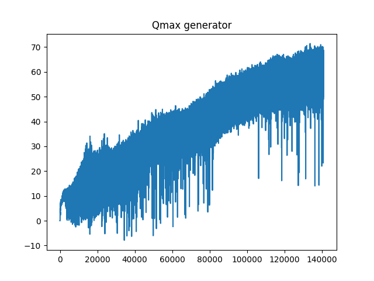
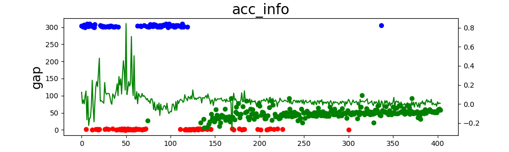

# -20210914_代码增加checkpoint点

##### *训练代码：20210906_Reward_sample.py*

##### *版本特征：yolo目标检测，ImageDraw处理检测框，新增从checkpoint点继续训练*

##### *T=3.5；D=50*

##### 本次commit细节：

20210913使用和20210912相同reward，相同环境进行训练，结果如下：

Qmax步进结果：

训练结果：

##### 分析：

时间戳为1631506899(20210913)的训练和时间戳为1631323956(20210911)使用的环境和reward相同，但结果产生了较大的差异，可以看到训练在100次处基本收敛，但是依然会出现较多的碰撞点，其中尤其集中在130-230次迭代之间。相同的环境下训练结果差异较大可能的问题是在前期没有给出足够的错误状态，网络输出的状态导致了150次迭代之后的碰撞，而碰撞所计算出来的reward在DDQN训练时会导致较大的train loss从而更好地反向更新网络参数。意味着此模型在训练中收敛速度快慢一定程度上是算法决定的，另一部分是由初始随即动作决定的。

ACC跟车模型使用的网络为四层卷积加两层全连接，两层全连接网络中间由concatenate将图像卷积结果和后车速度拼接在一起。前四层全连接用于对图像做特征提取（用于前车距离测量，两车加速度测量...），而后两层全连接用于拟合前四层卷积提取的特征信息和后车速度之间的关系式。

如果理解了这一点，返回之前的CarRacing中去修改DDPG代码是否会使DDPG效果更好。

##### 代码新增：

本次commit代码新增checkpoint训练，使用时间戳为1631506899(20210913)的训练结果继续训练随机初始距离的环境。

##### 新增代码已解决问题：

从checkpoint点开始训练，如果训练开始还是和之前一样设置*agent.train_start=100*，会造成经验池样本量过少，相同的样本多次训练，从而会快速导致deadlock，也就是出现严重过拟合。

解决方法就是将agent.train_start=3000，设置足够大的样本量训练，防止过拟合。

##### *提出假设：是否可以像在keras中设置梯度阈值，当梯度超过这个阈值才会进行参数更新（近期可以查找相关api）*

##### 当前代码对应git版本：commit 2a0544f1478d7726967221da885ac25aec68d57b

##### 训练结果对应时间戳：train_log_1631506899_reward_with_nonerandom.txt

