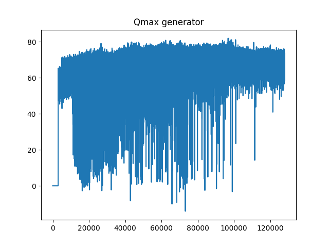
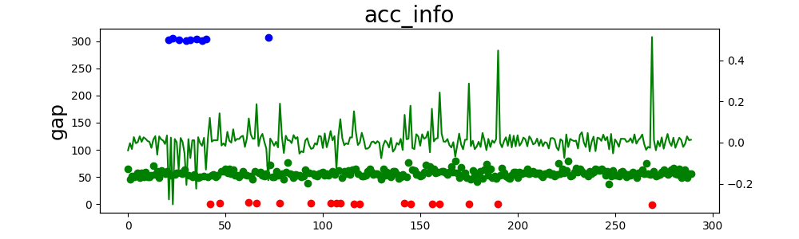

# -20210917_checkpoint训练测试

##### *训练代码：20210906_Reward_sample.py*

##### *版本特征：yolo目标检测，ImageDraw处理检测框，新增从checkpoint点继续训练*

##### *T=3.5；D=50*

##### 本次commit细节：

Qmax记录值：

训练记录：

分析：

可以看到从checkpoint点开始训练的qmax值随着训练次数的提升逐渐收敛。

根据训练迭代图像得出，在迭代100次之后，依然会出现撞车。

##### 当前代码对应git版本：commit 8064869250e727d1bc5cd2bc2fa1d59f60ea9410

##### 训练结果对应时间戳：train_log_1631599540_checkpoint_train.txt

##### 测试结果对应时间戳：train_log_1631781415_test.txt